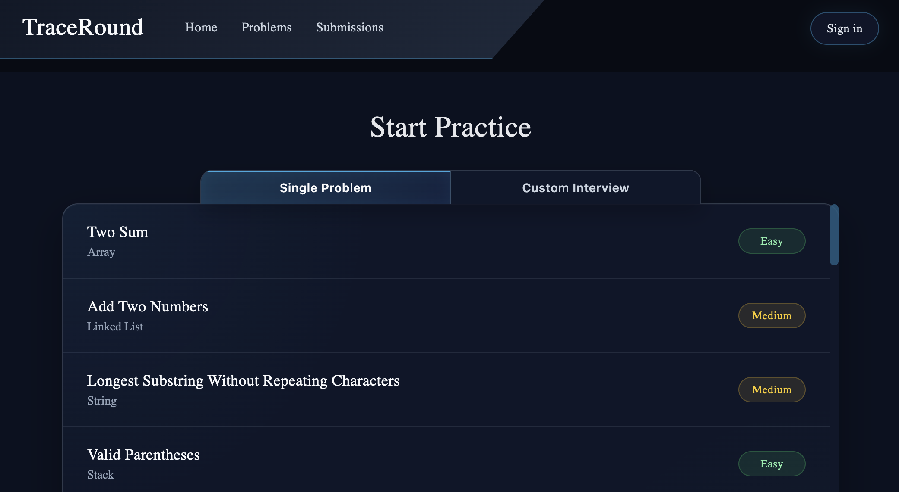
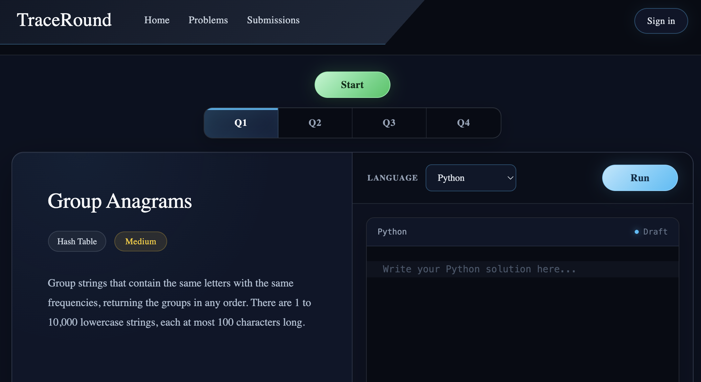

# TraceRound

TraceRound is a coding interview practice platform where users can improve communication and interview skills. Users can practice single problems or create custom interviews based on selected coding problem categories. Throughout each coding problem, users will be prompted with questions and comments that they must respond to. At the end of the practice session, users will receive feedback and areas to improve.

## Screenshots

### Problem List

View a list of problems including difficulty and topic. 



### Problem Interface

Participate in a mock interview with a question, coding interface, and feedback.



## Current Features

- React/Vite frontend setup
- Header navigation
- Problems page
- Single Problem and Custom Interview navigation
- Custom category selection UI
- Dynamic routing for individual problem pages
- Individual problem detail pages
- Code editor interface

## Planned Features

- AI-powered interview feedback
- User submissions page
- Spring Boot backend
- Problem and submission storage
- User sign-in and authentication
- User history storage

## Tech Stack

- React
- Vite
- JavaScript
- CSS

## Planned Backend

- Java
- Spring Boot

## Running the Frontend

```bash
cd frontend
npm install
npm run dev
```

After starting the development server, open the local URL shown in the terminal.